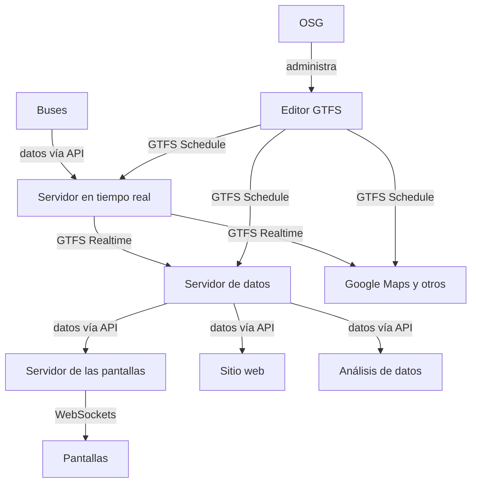

# Acción Social

> Mi trabajo de acción social combina mis intereses de investigación y otros temas de interés personal para participar en la atención de necesidades comunitarias. Actualmente trabajo en dos grandes temas: transporte público y ferias del egricultor. En ambas áreas aplicamos herramientas de desarrollo de sistemas de información para la creación de sitios informativos junto con campañas de sensibilización en redes sociales. Esto acompañado de estudios de opinión, entrevistas, conversatorios y otras formas de acercamiento a la comunidad.

## Trabajo comunal universitario

Soy parte del proyecto de trabajo comunal universitario "Tropicalización de la tecnología" desde el 2018.

!!! abstract "Proyecto de Acción Social TC-691 (2018 - presente)"
    
    

    Un trabajo comunal universitario dedicado a la aplicación de soluciones tecnológicas a problemas comunitarios.

## Ferias del agricultor

A partir de la pregunta **¿dónde está la feria y cuándo está abierta?** comenzamos a explorar un tema que nos pareció fascinante. De ahí nació el proyecto **deferia.cr**. Encontramos un vacío de información para el público en general sobre la operación de las ferias del agricultor, donde solo es posible encontrar información dispersa, desactualizada y en formatos poco accesibles.

??? note "Las consignas de nuestro proyecto"
    Promovemos las ferias del agricultor convencidos de las siguientes premisas:
    
    1. El mejor lugar para comprar productos frescos por precio, variedad y frescura es la feria del agricultor.
    2. La mejor dieta para la salud humana está basada en productos frescos de origen vegetal.
    3. Las ferias benefician directamente a las familias comerciantes dedicadas a la producción agrícola.
    4. Las ferias benefician directamente a las familias consumidoras, y representan un instrumento efectivo para la seguridad alimentaria y nutricional. 
    5. Las ferias son espacios sociales y culturales relevantes para Costa Rica, con una tradición de muchas décadas. 

-  :material-fruit-watermelon:{ .lg .middle } **ferias**
    
    ---
    
    Un proyecto de difusión de las ferias del agricultor en Costa Rica con una página web informativa. 
    
    [:material-link-circle: deferia.cr](https://deferia.cr/)

    [:material-github: fabianabarca/ferias](https://github.com/fabianabarca/ferias)

    <small>Django | Python | Web API | PostgreSQL | PostGIS</small>

-  :material-share-variant:{ .lg .middle } **Redes sociales**
    
    ---
    
    Un proyecto de difusión de las ferias del agricultor en Costa Rica con una campaña de redes sociales. 
    
    [:material-instagram: instagram/deferia.cr](https://instagram/deferia.cr/)

    [:material-facebook: Facebook](https://web.facebook.com/deferia.costarica)

    [:simple-tiktok: tiktok/@deferia.cr](https://www.tiktok.com/@deferia.cr)

## Sistemas de información del transporte público

Desde el TCU hemos hecho nuestro aporte para paliar una de las carencias más evidentes de los sistemas de transporte público en Costa Rica: la falta de información clara sobre su operación.

### Plan piloto de los buses de la UCR

En conjunto con el proyecto de investigación 322-C3-184 y el seminario de graduación de licenciatura, el TCU está creando el primer sistema integral de información del servicio de transporte público en el país, para el bus interno de la Universidad de Costa Rica.

El nuevo logo del sistema *b***UCR** es:

Los trabajos en desarrollo en el proyecto son:

- Una encuesta de satisfacción de las personas usuarias
- Levantamiento de datos **GTFS Schedule** (1) para Google Maps y Moovit
- Una propuesta de un sistema de señalética (rotulación)
- Un sistema de recolección de datos de los buses en tiempo real
- Publicación de **GTFS Realtime** (2) para aplicaciones y pantallas
- Pantallas informativas en paradas y espacios seleccionados
- Campaña de comunicación sobre el sistema y el transporte público

1. GTFS Schedule es la versión "estática" del estándar de datos abiertos, e incluye información como rutas, horarios, paradas, trayectorias y tarifas.
2. GTFS Realtime es la versión en tiempo real del estándar de datos abiertos, e incluye información como ubicación actual, porcentaje de ocupación del bus, actualización de tiempos de llegada y alertas del servicio.

El sistema de datos en tiempo real para las pantallas y otros servicios de información tiene la siguiente estructura[^1]:

[^1]:
    OSG es la Oficina de Servicios Generales, encargada de la administración del servicio.

-  :material-text-box:{ .lg .middle } **Informe de encuesta de satisfacción**
    
    ---
    
    Un reporte de la encuesta aplicada a más de 700 personas en el campus Rodrigo Facio con un instrumento desarrollado para evaluar el servicio del bus interno.

    [:material-link-circle: Repositorio Kérwá 10669/91076](https://kerwa.ucr.ac.cr/handle/10669/91076)

    <small>Canva</small>

-  :material-bus:{ .lg .middle } **bucr**
    
    ---
    
    Una página web con información del servicio de buses de la Universidad de Costa Rica, *b***UCR**. Primera versión estática.
    
    [:material-link-circle: bus.ucr.ac.cr](https://bus.ucr.ac.cr/).

    [:material-github: fabianabarca/bucr](https://github.com/fabianabarca/bucr)

    <small>HTML | Bootstrap</small>

-  :material-bus-sign:{ .lg .middle } **senaletica**
    
    ---
    
    Propuesta del sistema de señalética para el sistema de información del bus interno de la Universidad de Costa Rica.

    [:material-link-circle: fabianabarca.github.io/senaletica/](https://fabianabarca.github.io/senaletica/)
    
    [:material-github: fabianabarca/senaletica](https://github.com/fabianabarca/senaletica)

    <small>Inkscape</small>

### Buses de San Gabriel y Acosta

En 2020 comenzamos nuestro primer proyecto de transporte público, para facilitar la información del servicio de buses a las comunidades de San Gabriel de Aserrí, San Ignacio de Acosta y alrededores.

!!! tip "¡Seguimos siendo visitados!"
    Hoy en día este sitio recibe en promedio 1000 visitantes diarios, lo cual confirma la utilidad que tiene para la comunidad. Tiene picos de visitación en fines de semana y feriados, cuando los horarios son especiales y las personas están procurando información.

!!! tip "¡Primeros en Google Maps!"
    Este es el primer servicio de buses en Costa Rica con presencia en Google Maps, gracias al uso de [datos estandarizados GTFS](https://transportessangabriel.com/gtfs/). Y, hasta el momento, seguimos siendo los únicos.

<blockquote class="twitter-tweet">
¿Cómo hacen ustedes cuando necesitan información de los buses en Costa Rica? ¿Encuentran fácilmente lo que buscan, como horarios y tarifas? En nuestro TCU hicimos un sitio web con datos «estandarizados» para usuarixs de 🚍 de la región Caraigres y esto fue lo que resultó 🧵
&mdash; Fab (@fabianabarca) <a href="https://twitter.com/fabianabarca/status/1426194551597944835?ref_src=twsrc%5Etfw">August 13, 2021</a></blockquote> 

El sitio está disponible como un proyecto de código abierto.

-  :material-bus-side:{ .lg .middle } **buses**
    
    ---
    
    Una página web con información de las rutas de buses San Luis de Acosta - San José, Turrujal - San José, San Gabriel - San José, incluyendo: próximos buses, horarios, tarifas, mapas y paradas. 
    
    [:material-link-circle: transportessangabriel.com](https://transportessangabriel.com/)

    [:material-github: fabianabarca/buses](https://github.com/fabianabarca/buses)

    <small>Django | Python | Vue</small>

### Buses y colectivos de Pavas

Estamos colaborando con el [Centro para la Sostenibilidad Urbana](https://cpsurbana.org/) (CPSU) en su proyecto de desarrollo para el transporte popular en la zona de Pavas, San José, Costa Rica. Esto es parte del [Programa Global de Investigación sobre Movilidad Informal y Compartida](https://vref.se/ism/) (ISM) de la [Fundación Volvo para la Investigación y Educación](https://vref.se/) (VREF).

Nuestra colaboración específica es la elaboración de un suministro (*feed*) de datos abiertos estandarizados del transporte público en Pavas, utilizando las especificaciones [GTFS Schedule](https://gtfs.org/es/schedule/) para el servicio regular de Autotransportes Pavas y [GTFS Flex](https://gtfs.org/es/extensions/flex/) para el servicio popular o informal, que es de uso frecuente e importante en la región.

Esta implementación facilitará el acceso a la información del servicio, en una zona de vulnerabilidad socioeconómica que depende, en buena medida, del transporte público para la movilización de sus pobladores, incluyendo las personas trabajadoras.

## Grupo de afinidad en transporte público inteligente

Desde 2024 creé el perfil de Instagram [@tpi.ucr](https://instagram.com/tpi.ucr) (TPi), como un grupo de afinidad sobre sistemas inteligentes de transporte público en la Universidad de Costa Rica, para compartir sobre el tema y nuestros desarrollos en la universidad.

## Movilidad activa

### Campaña "Supremacía Peatonal"

:warning: Pronto en carreteras

## Otros trabajos

Como parte de este TCU decidimos resolver una necesidad que teníamos con el registro de horas de trabajo, y aprovechamos nuestro conocimiento en desarrollo web para crear el siguiente sistema.

-  :material-clock:{ .lg .middle } **horas**
    
    ---
    
    Una página web para el registro de horas de trabajo comunal universitario en TC-691 "Tropicalización de la tecnología". 
    
    [:material-link-circle: tropicalizacion.eie.ucr.ac.cr](https://tropicalizacion.eie.ucr.ac.cr/)

    [:material-github: fabianabarca/horas](https://github.com/fabianabarca/horas)

    <small>Django | Python</small>

En 2024 la Vicerrectoría de Acción Social lanzó su propia plataforma de registro de horas, inspirados parcialmente en nuestro desarrollo.
