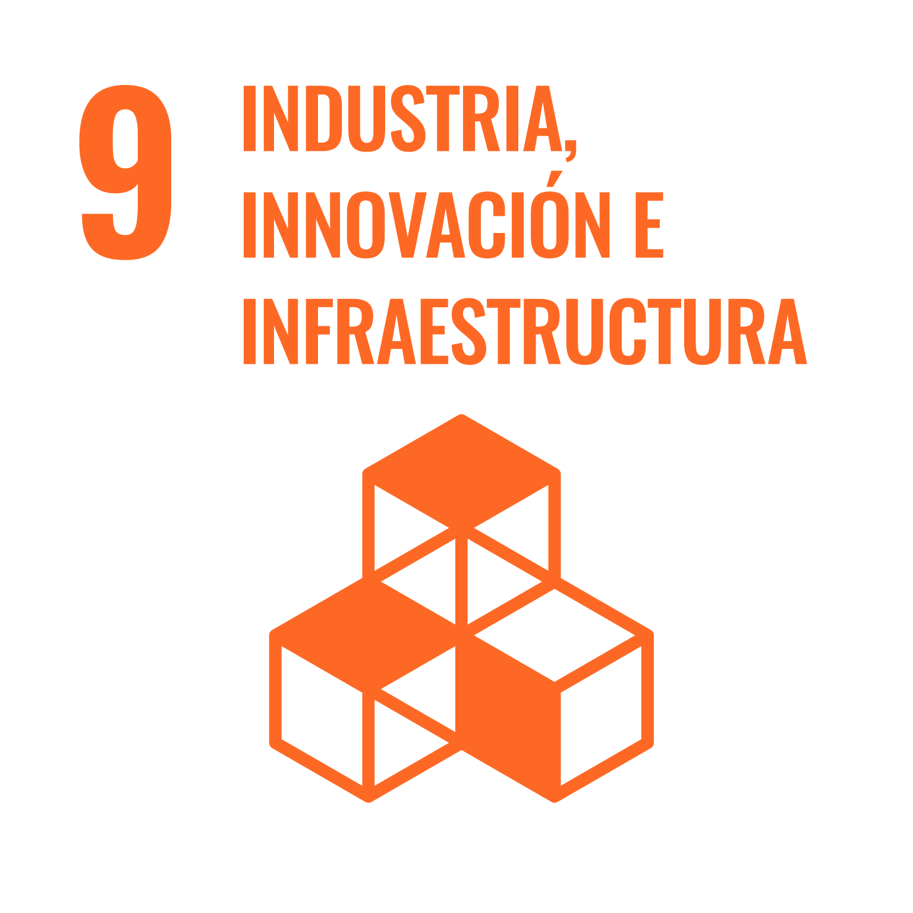
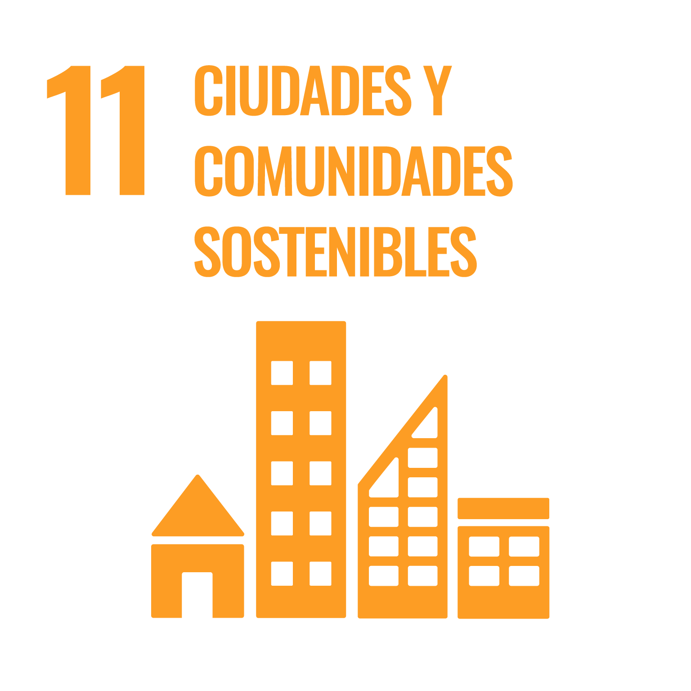

# Fabián Abarca Calderón  <small>Ing., Lic., M.Sc.</small>

## Hola

Soy profesor de la **Escuela de Ingeniería Eléctrica** de la Universidad de Costa Rica.

## Intereses académicos

Realizo investigación, docencia y acción social en los siguientes temas:

- Sistemas inteligentes de transporte público
- Análisis de datos y aprendizaje automático
- Sistemas de telecomunicaciones y redes
- Computación científica para la docencia
- Ingeniería de sistemas (*lato sensu*)
- Movilidad activa y ciclismo urbano
- Visualización de datos
- Ferias del agricultor

Actualmente soy estudiante del **Programa de Doctorado en Ingeniería** de la Universidad de Costa Rica y el Instituto Tecnológico de Costa Rica.

En mi labor colaboro en el desarrollo de los siguientes [Objetivos de Desarrollo Sostenible](https://www.un.org/sustainabledevelopment/es/) (ODS) de las Naciones Unidas.

-   
    
    **Objetivo 9**

    Construir infraestructuras resilientes, promover la industrialización sostenible y fomentar la innovación.

    [:material-plus-box: Más información](https://www.un.org/sustainabledevelopment/es/infrastructure/)

-   

    **Objetivo 11**
    
    Lograr que las ciudades sean más inclusivas, seguras, resilientes y sostenibles.

    [:material-plus-box: Más información](https://www.un.org/sustainabledevelopment/es/cities/)

