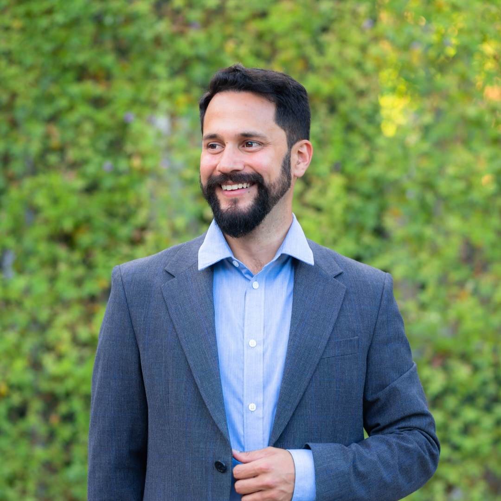

# Fabián Abarca Calderón

## ¡Hola! 

<!--{ align=left }-->

Soy profesor de la Escuela de Ingeniería Eléctrica de la Universidad de Costa Rica y estudiante del Programa de Doctorado en Ingeniería de la Universidad de Costa Rica y el Instituto Tecnológico de Costa Rica.

## Intereses

Realizo investigación, docencia y acción social (o simplemente me gustan) los siguientes temas:

- Sistemas de telecomunicaciones y redes
- Sistemas inteligentes de transporte público
- Ferias del agricultor
- Computación científica para la enseñanza
- Visualización de datos
- Análisis de datos y aprendizaje automático
- Movilidad activa, especialmente ciclismo urbano