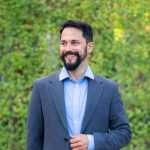

# Información personal

## Fabián Abarca Calderón

{ align=left }

Soy de San Gabriel de Aserrí (San José, Costa Rica) y actualmente vivo en João Pessoa (Paraíba, Brasil).

**Algunas confesiones**

Quise ser profesor un día que comencé a explicar a unos amigos un tema que no entendía muy bien y, mientras lo hacía, mágicamente lo entendí mejor. No sucede siempre, pero es una bonita sensación que decidí seguir buscando en mi vida profesional.

Honestamente, no terminé la carrera convencido de que me gustaba la ingeniería eléctrica, pero ahora tengo la suerte de admirar profundamente la diversidad de aplicaciones fascinantes que son posibles, y el impacto que pueden tener estas tecnologías en las personas y en nuestro planeta. Nota a mi yo más joven: está bien dudar de nuestra vocación, es un ejercicio necesario, si bien difícil.

Me gusta (y me asusta) pensar en las aplicaciones en que la ingeniería interactúa con otros saberes, y mis proyectos actuales de investigación, docencia y acción social buscan actuar dentro de esos espacios.

## Estudios

- **Bachillerato** en Ingeniería Eléctrica (UCR)
- **Licenciatura** en Ingeniería Eléctrica (UCR)
- **Maestría** en *Electrical and Computer Engineering* (Northeastern University | Fulbright Scholar)
- **Doctorando** en Ingeniería (UCR/ITCR) 

## Intereses personales

Aficionado a la música, la guitarra clásica y la batería y percusión en general. Me gusta el fútbol y los deportes. Muy a mi pesar, me gusta la política y la realidad nacional e internacional. A veces peleo en Twitter por eso.

## Información de contacto

[:material-email: fabian.abarca@ucr.ac.cr](mailto:fabian.abarca@ucr.ac.cr)
